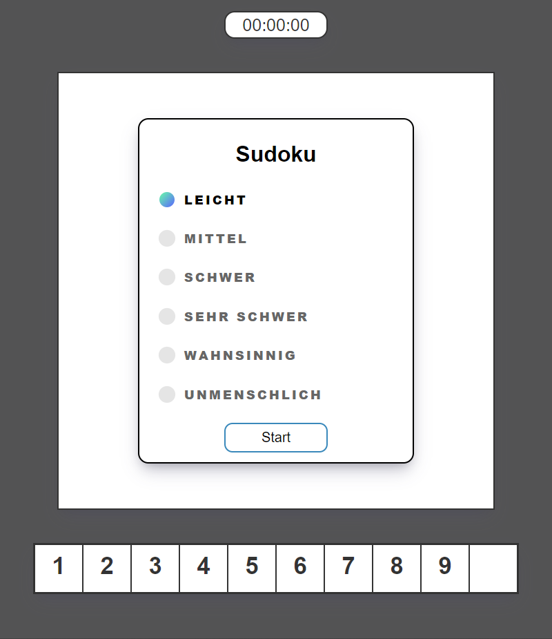
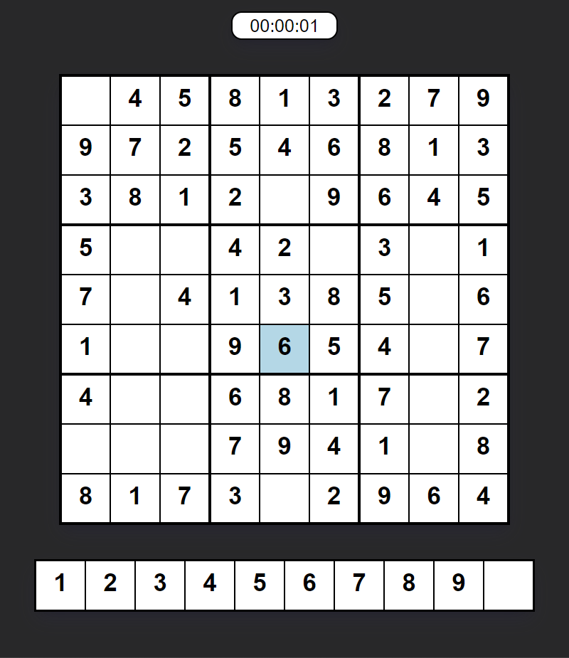
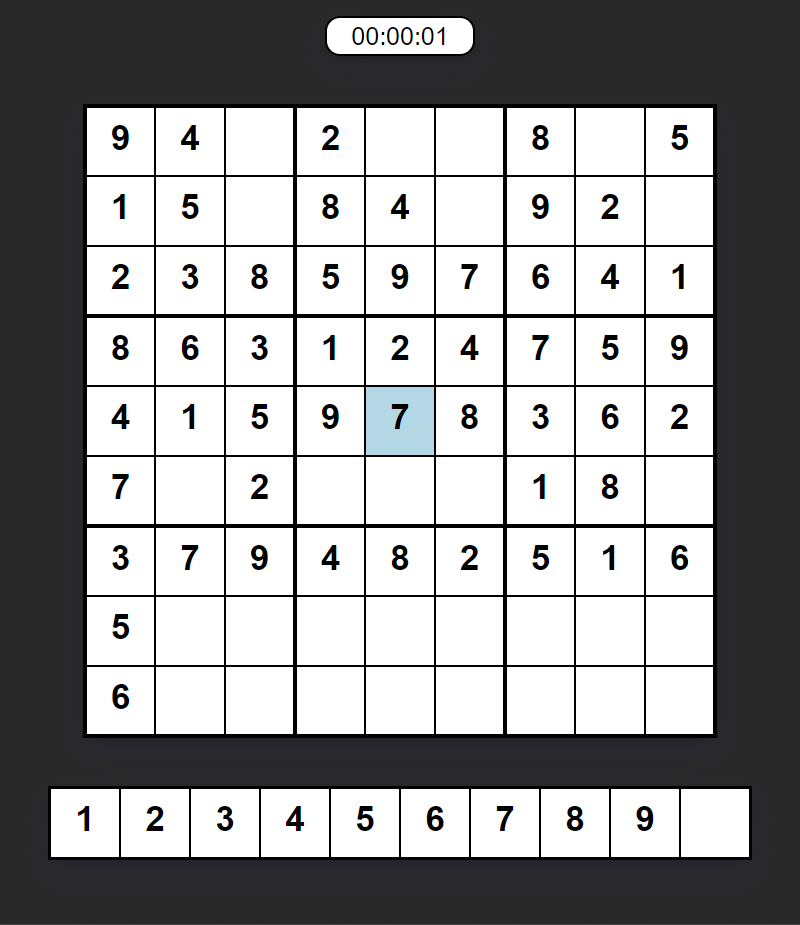
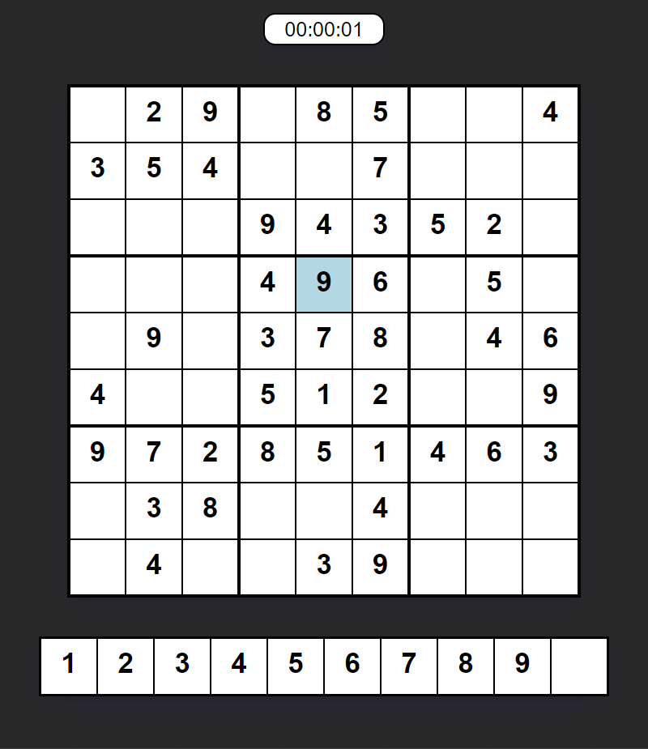
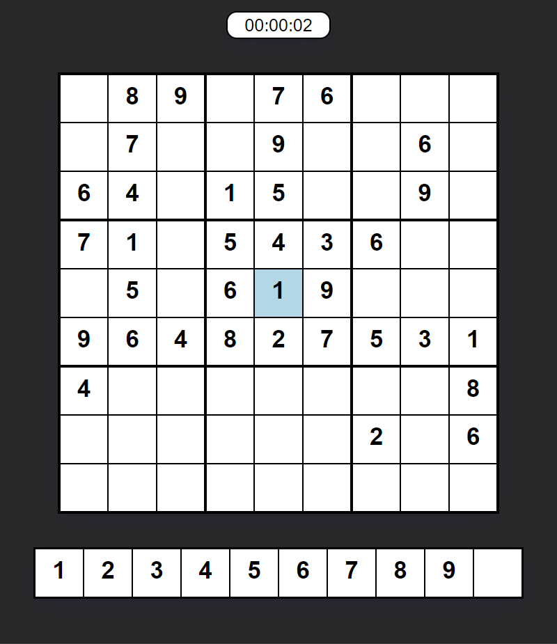
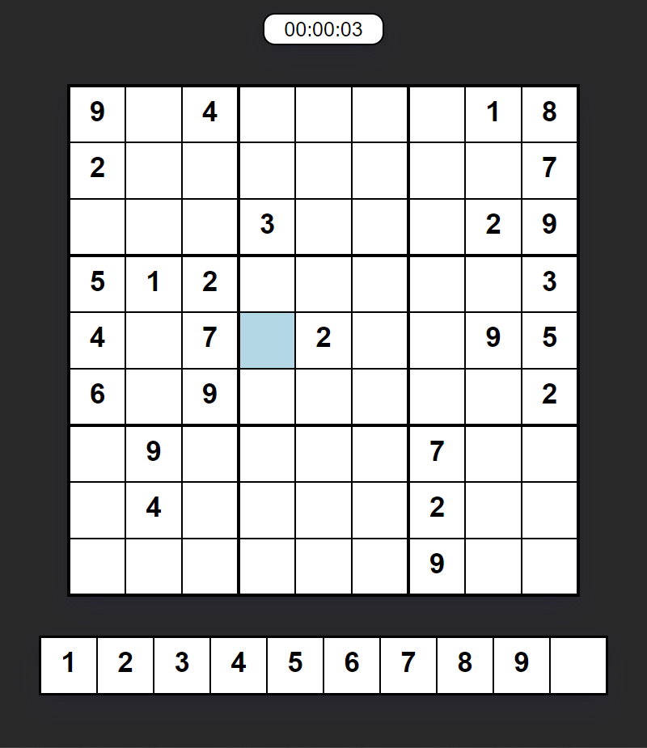
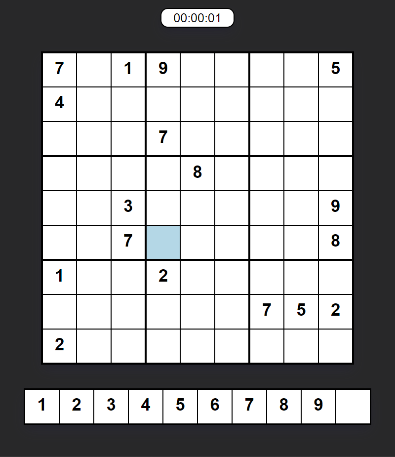

# Sudoku

## Table of Contents

-   [Description](#description)
-   [Build](#build)
-   [Presentation](#presentation)

## Description

Sudoku is a logic-based, combinatorial number-placement puzzle. The objective is to fill a 9×9 grid with digits so that each column, each row, and each of the nine 3×3 subgrids that compose the grid (also called "boxes", "blocks", or "regions") contain all of the digits from 1 to 9. The puzzle setter provides a partially completed grid, which for a well-posed puzzle has a single solution. Completed games are always a type of Latin square with an additional constraint on the contents of individual regions. For example, the same single integer may not appear twice in the same row, column, or any of the nine 3×3 subregions of the 9×9 playing board. [Wikipedia](https://en.wikipedia.org/wiki/Sudoku)

## Build

The project is build by using vanilla JavaScript, HTML and CSS.

## Presentation

    <table>
        <tr>
    	    <td style="padding:10px">
        	    
                 
                <em>Menu</em>
      	    </td>
        </tr>   
	    <tr>
    	    <td style="padding:10px">
        	    
                 
                <em>Easy</em>
      	    </td>
            <td style="padding:10px">
            	
                 
                <em>Medium</em>
            </td>
        </tr>
        <tr>
    	    <td style="padding:10px">
        	    
                 
                <em>Hard</em>
      	    </td>
            <td style="padding:10px">
            	
                 
                <em>Very-Hard</em>
            </td>
        </tr>
        <tr>
    	    <td style="padding:10px">
        	    
                 
                <em>Insane</em>
      	    </td>
            <td style="padding:10px">
            	
                 
                <em>Inhuman</em>
            </td>
        </tr>
    </table>

